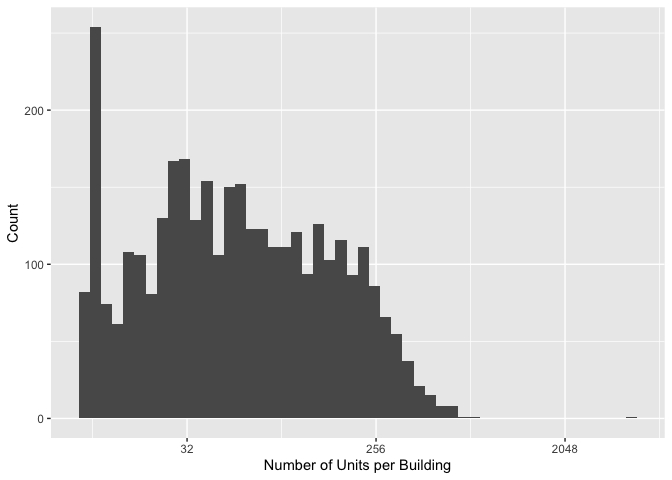
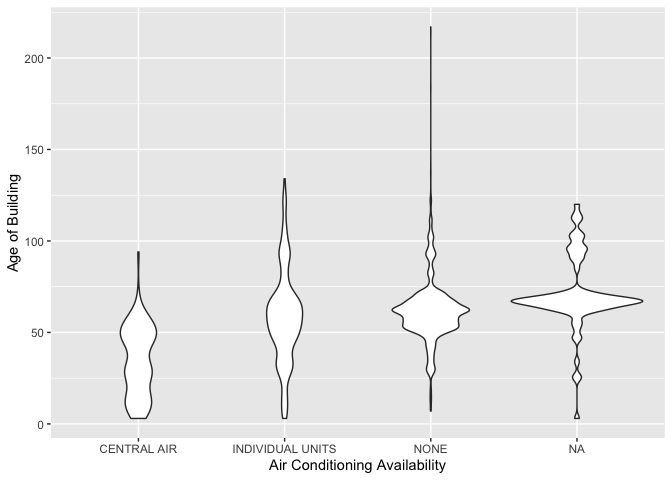
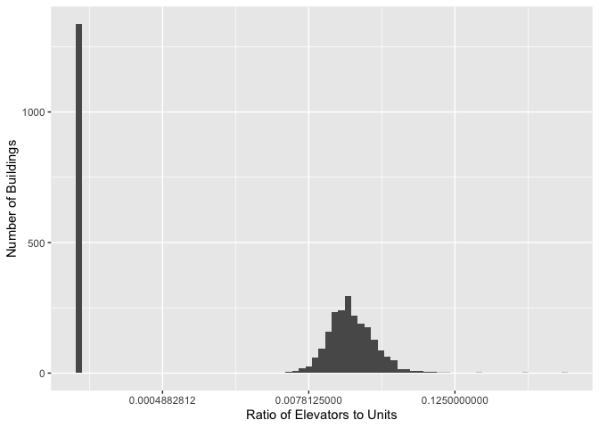
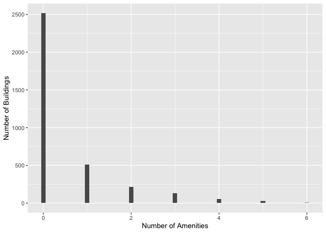
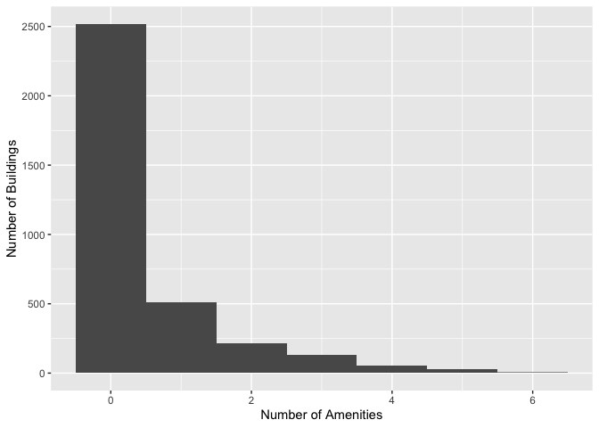
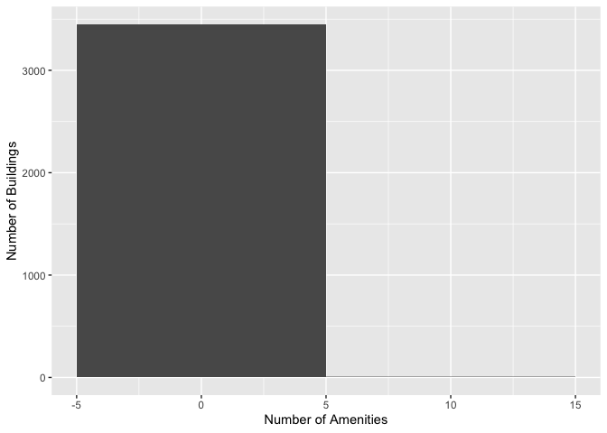
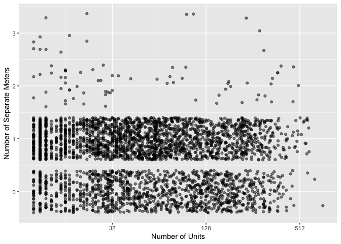
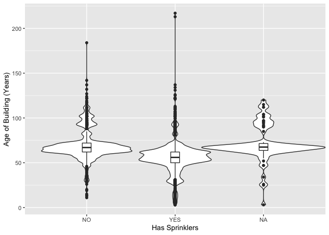

Mini Data-Analysis Deliverable 1
================

# Welcome to your (maybe) first-ever data analysis project!

And hopefully the first of many. Let’s get started:

1.  Install the [`datateachr`](https://github.com/UBC-MDS/datateachr)
    package by typing the following into your **R terminal**:

<!-- -->

    install.packages("devtools")
    devtools::install_github("UBC-MDS/datateachr")

2.  Load the packages below.

``` r
library(datateachr)
library(tidyverse)
```

    ## ── Attaching packages ─────────────────────────────────────── tidyverse 1.3.2 ──
    ## ✔ ggplot2 3.3.6     ✔ purrr   0.3.4
    ## ✔ tibble  3.1.8     ✔ dplyr   1.0.9
    ## ✔ tidyr   1.2.0     ✔ stringr 1.4.0
    ## ✔ readr   2.1.2     ✔ forcats 0.5.2
    ## ── Conflicts ────────────────────────────────────────── tidyverse_conflicts() ──
    ## ✖ dplyr::filter() masks stats::filter()
    ## ✖ dplyr::lag()    masks stats::lag()

``` r
library(fastDummies)
```

3.  Make a repository in the <https://github.com/stat545ubc-2022>
    Organization. You will be working with this repository for the
    entire data analysis project. You can either make it public, or make
    it private and add the TA’s and Lucy as collaborators. A link to
    help you create a private repository is available on the
    \#collaborative-project Slack channel.

# Instructions

## For Both Milestones

-   Each milestone is worth 45 points. The number of points allocated to
    each task will be annotated within each deliverable. Tasks that are
    more challenging will often be allocated more points.

-   10 points will be allocated to the reproducibility, cleanliness, and
    coherence of the overall analysis. While the two milestones will be
    submitted as independent deliverables, the analysis itself is a
    continuum - think of it as two chapters to a story. Each chapter, or
    in this case, portion of your analysis, should be easily followed
    through by someone unfamiliar with the content.
    [Here](https://swcarpentry.github.io/r-novice-inflammation/06-best-practices-R/)
    is a good resource for what constitutes “good code”. Learning good
    coding practices early in your career will save you hassle later on!

## For Milestone 1

**To complete this milestone**, edit [this very `.Rmd`
file](https://raw.githubusercontent.com/UBC-STAT/stat545.stat.ubc.ca/master/content/mini-project/mini-project-1.Rmd)
directly. Fill in the sections that are tagged with
`<!--- start your work below --->`.

**To submit this milestone**, make sure to knit this `.Rmd` file to an
`.md` file by changing the YAML output settings from
`output: html_document` to `output: github_document`. Commit and push
all of your work to the mini-analysis GitHub repository you made
earlier, and tag a release on GitHub. Then, submit a link to your tagged
release on canvas.

**Points**: This milestone is worth 45 points: 43 for your analysis, 1
point for having your Milestone 1 document knit error-free, and 1 point
for tagging your release on Github.

# Learning Objectives

By the end of this milestone, you should:

-   Become familiar with your dataset of choosing
-   Select 4 questions that you would like to answer with your data
-   Generate a reproducible and clear report using R Markdown
-   Become familiar with manipulating and summarizing your data in
    tibbles using `dplyr`, with a research question in mind.

# Task 1: Choose your favorite dataset (10 points)

The `datateachr` package by Hayley Boyce and Jordan Bourak currently
composed of 7 semi-tidy datasets for educational purposes. Here is a
brief description of each dataset:

-   *apt_buildings*: Acquired courtesy of The City of Toronto’s Open
    Data Portal. It currently has 3455 rows and 37 columns.

-   *building_permits*: Acquired courtesy of The City of Vancouver’s
    Open Data Portal. It currently has 20680 rows and 14 columns.

-   *cancer_sample*: Acquired courtesy of UCI Machine Learning
    Repository. It currently has 569 rows and 32 columns.

-   *flow_sample*: Acquired courtesy of The Government of Canada’s
    Historical Hydrometric Database. It currently has 218 rows and 7
    columns.

-   *parking_meters*: Acquired courtesy of The City of Vancouver’s Open
    Data Portal. It currently has 10032 rows and 22 columns.

-   *steam_games*: Acquired courtesy of Kaggle. It currently has 40833
    rows and 21 columns.

-   *vancouver_trees*: Acquired courtesy of The City of Vancouver’s Open
    Data Portal. It currently has 146611 rows and 20 columns.

**Things to keep in mind**

-   We hope that this project will serve as practice for carrying our
    your own *independent* data analysis. Remember to comment your code,
    be explicit about what you are doing, and write notes in this
    markdown document when you feel that context is required. As you
    advance in the project, prompts and hints to do this will be
    diminished - it’ll be up to you!

-   Before choosing a dataset, you should always keep in mind **your
    goal**, or in other ways, *what you wish to achieve with this data*.
    This mini data-analysis project focuses on *data wrangling*,
    *tidying*, and *visualization*. In short, it’s a way for you to get
    your feet wet with exploring data on your own.

And that is exactly the first thing that you will do!

1.1 Out of the 7 datasets available in the `datateachr` package, choose
**4** that appeal to you based on their description. Write your choices
below:

**Note**: We encourage you to use the ones in the `datateachr` package,
but if you have a dataset that you’d really like to use, you can include
it here. But, please check with a member of the teaching team to see
whether the dataset is of appropriate complexity. Also, include a
**brief** description of the dataset here to help the teaching team
understand your data.

<!-------------------------- Start your work below ---------------------------->

1: apt_buildings 2: cancer_sample 3: flow_sample 4: parking_meters

<!----------------------------------------------------------------------------->

1.2 One way to narrowing down your selection is to *explore* the
datasets. Use your knowledge of dplyr to find out at least *3*
attributes about each of these datasets (an attribute is something such
as number of rows, variables, class type…). The goal here is to have an
idea of *what the data looks like*.

*Hint:* This is one of those times when you should think about the
cleanliness of your analysis. I added a single code chunk for you below,
but do you want to use more than one? Would you like to write more
comments outside of the code chunk?

<!-------------------------- Start your work below ---------------------------->

I will use the `glimpse` function to identify the number of rows, the
number of columns, the variables included, and the class type of each
variable. This function also enables me to see the first few rows of the
dataset.

``` r
glimpse(apt_buildings)
```

    ## Rows: 3,455
    ## Columns: 37
    ## $ id                               <dbl> 10359, 10360, 10361, 10362, 10363, 10…
    ## $ air_conditioning                 <chr> "NONE", "NONE", "NONE", "NONE", "NONE…
    ## $ amenities                        <chr> "Outdoor rec facilities", "Outdoor po…
    ## $ balconies                        <chr> "YES", "YES", "YES", "YES", "NO", "NO…
    ## $ barrier_free_accessibilty_entr   <chr> "YES", "NO", "NO", "YES", "NO", "NO",…
    ## $ bike_parking                     <chr> "0 indoor parking spots and 10 outdoo…
    ## $ exterior_fire_escape             <chr> "NO", "NO", "NO", "YES", "NO", NA, "N…
    ## $ fire_alarm                       <chr> "YES", "YES", "YES", "YES", "YES", "Y…
    ## $ garbage_chutes                   <chr> "YES", "YES", "NO", "NO", "NO", "NO",…
    ## $ heating_type                     <chr> "HOT WATER", "HOT WATER", "HOT WATER"…
    ## $ intercom                         <chr> "YES", "YES", "YES", "YES", "YES", "Y…
    ## $ laundry_room                     <chr> "YES", "YES", "YES", "YES", "YES", "Y…
    ## $ locker_or_storage_room           <chr> "NO", "YES", "YES", "YES", "NO", "YES…
    ## $ no_of_elevators                  <dbl> 3, 3, 0, 1, 0, 0, 0, 2, 4, 2, 0, 2, 2…
    ## $ parking_type                     <chr> "Underground Garage , Garage accessib…
    ## $ pets_allowed                     <chr> "YES", "YES", "YES", "YES", "YES", "Y…
    ## $ prop_management_company_name     <chr> NA, "SCHICKEDANZ BROS. PROPERTIES", N…
    ## $ property_type                    <chr> "PRIVATE", "PRIVATE", "PRIVATE", "PRI…
    ## $ rsn                              <dbl> 4154812, 4154815, 4155295, 4155309, 4…
    ## $ separate_gas_meters              <chr> "NO", "NO", "NO", "NO", "NO", "NO", "…
    ## $ separate_hydro_meters            <chr> "YES", "YES", "YES", "YES", "YES", "Y…
    ## $ separate_water_meters            <chr> "NO", "NO", "NO", "NO", "NO", "NO", "…
    ## $ site_address                     <chr> "65  FOREST MANOR RD", "70  CLIPPER R…
    ## $ sprinkler_system                 <chr> "YES", "YES", "NO", "YES", "NO", "NO"…
    ## $ visitor_parking                  <chr> "PAID", "FREE", "UNAVAILABLE", "UNAVA…
    ## $ ward                             <chr> "17", "17", "03", "03", "02", "02", "…
    ## $ window_type                      <chr> "DOUBLE PANE", "DOUBLE PANE", "DOUBLE…
    ## $ year_built                       <dbl> 1967, 1970, 1927, 1959, 1943, 1952, 1…
    ## $ year_registered                  <dbl> 2017, 2017, 2017, 2017, 2017, NA, 201…
    ## $ no_of_storeys                    <dbl> 17, 14, 4, 5, 4, 4, 4, 7, 32, 4, 4, 7…
    ## $ emergency_power                  <chr> "NO", "YES", "NO", "NO", "NO", "NO", …
    ## $ `non-smoking_building`           <chr> "YES", "NO", "YES", "YES", "YES", "NO…
    ## $ no_of_units                      <dbl> 218, 206, 34, 42, 25, 34, 14, 105, 57…
    ## $ no_of_accessible_parking_spaces  <dbl> 8, 10, 20, 42, 12, 0, 5, 1, 1, 6, 12,…
    ## $ facilities_available             <chr> "Recycling bins", "Green Bin / Organi…
    ## $ cooling_room                     <chr> "NO", "NO", "NO", "NO", "NO", "NO", "…
    ## $ no_barrier_free_accessible_units <dbl> 2, 0, 0, 42, 0, NA, 14, 0, 0, 1, 25, …

``` r
glimpse(cancer_sample)
```

    ## Rows: 569
    ## Columns: 32
    ## $ ID                      <dbl> 842302, 842517, 84300903, 84348301, 84358402, …
    ## $ diagnosis               <chr> "M", "M", "M", "M", "M", "M", "M", "M", "M", "…
    ## $ radius_mean             <dbl> 17.990, 20.570, 19.690, 11.420, 20.290, 12.450…
    ## $ texture_mean            <dbl> 10.38, 17.77, 21.25, 20.38, 14.34, 15.70, 19.9…
    ## $ perimeter_mean          <dbl> 122.80, 132.90, 130.00, 77.58, 135.10, 82.57, …
    ## $ area_mean               <dbl> 1001.0, 1326.0, 1203.0, 386.1, 1297.0, 477.1, …
    ## $ smoothness_mean         <dbl> 0.11840, 0.08474, 0.10960, 0.14250, 0.10030, 0…
    ## $ compactness_mean        <dbl> 0.27760, 0.07864, 0.15990, 0.28390, 0.13280, 0…
    ## $ concavity_mean          <dbl> 0.30010, 0.08690, 0.19740, 0.24140, 0.19800, 0…
    ## $ concave_points_mean     <dbl> 0.14710, 0.07017, 0.12790, 0.10520, 0.10430, 0…
    ## $ symmetry_mean           <dbl> 0.2419, 0.1812, 0.2069, 0.2597, 0.1809, 0.2087…
    ## $ fractal_dimension_mean  <dbl> 0.07871, 0.05667, 0.05999, 0.09744, 0.05883, 0…
    ## $ radius_se               <dbl> 1.0950, 0.5435, 0.7456, 0.4956, 0.7572, 0.3345…
    ## $ texture_se              <dbl> 0.9053, 0.7339, 0.7869, 1.1560, 0.7813, 0.8902…
    ## $ perimeter_se            <dbl> 8.589, 3.398, 4.585, 3.445, 5.438, 2.217, 3.18…
    ## $ area_se                 <dbl> 153.40, 74.08, 94.03, 27.23, 94.44, 27.19, 53.…
    ## $ smoothness_se           <dbl> 0.006399, 0.005225, 0.006150, 0.009110, 0.0114…
    ## $ compactness_se          <dbl> 0.049040, 0.013080, 0.040060, 0.074580, 0.0246…
    ## $ concavity_se            <dbl> 0.05373, 0.01860, 0.03832, 0.05661, 0.05688, 0…
    ## $ concave_points_se       <dbl> 0.015870, 0.013400, 0.020580, 0.018670, 0.0188…
    ## $ symmetry_se             <dbl> 0.03003, 0.01389, 0.02250, 0.05963, 0.01756, 0…
    ## $ fractal_dimension_se    <dbl> 0.006193, 0.003532, 0.004571, 0.009208, 0.0051…
    ## $ radius_worst            <dbl> 25.38, 24.99, 23.57, 14.91, 22.54, 15.47, 22.8…
    ## $ texture_worst           <dbl> 17.33, 23.41, 25.53, 26.50, 16.67, 23.75, 27.6…
    ## $ perimeter_worst         <dbl> 184.60, 158.80, 152.50, 98.87, 152.20, 103.40,…
    ## $ area_worst              <dbl> 2019.0, 1956.0, 1709.0, 567.7, 1575.0, 741.6, …
    ## $ smoothness_worst        <dbl> 0.1622, 0.1238, 0.1444, 0.2098, 0.1374, 0.1791…
    ## $ compactness_worst       <dbl> 0.6656, 0.1866, 0.4245, 0.8663, 0.2050, 0.5249…
    ## $ concavity_worst         <dbl> 0.71190, 0.24160, 0.45040, 0.68690, 0.40000, 0…
    ## $ concave_points_worst    <dbl> 0.26540, 0.18600, 0.24300, 0.25750, 0.16250, 0…
    ## $ symmetry_worst          <dbl> 0.4601, 0.2750, 0.3613, 0.6638, 0.2364, 0.3985…
    ## $ fractal_dimension_worst <dbl> 0.11890, 0.08902, 0.08758, 0.17300, 0.07678, 0…

``` r
glimpse(flow_sample)
```

    ## Rows: 218
    ## Columns: 7
    ## $ station_id   <chr> "05BB001", "05BB001", "05BB001", "05BB001", "05BB001", "0…
    ## $ year         <dbl> 1909, 1910, 1911, 1912, 1913, 1914, 1915, 1916, 1917, 191…
    ## $ extreme_type <chr> "maximum", "maximum", "maximum", "maximum", "maximum", "m…
    ## $ month        <dbl> 7, 6, 6, 8, 6, 6, 6, 6, 6, 6, 6, 7, 6, 6, 6, 7, 5, 7, 6, …
    ## $ day          <dbl> 7, 12, 14, 25, 11, 18, 27, 20, 17, 15, 22, 3, 9, 5, 14, 5…
    ## $ flow         <dbl> 314, 230, 264, 174, 232, 214, 236, 309, 174, 345, 185, 24…
    ## $ sym          <chr> NA, NA, NA, NA, NA, NA, NA, NA, NA, NA, NA, NA, NA, NA, N…

``` r
glimpse(parking_meters)
```

    ## Rows: 10,032
    ## Columns: 22
    ## $ meter_head     <chr> "Twin", "Pay Station", "Twin", "Single", "Twin", "Twin"…
    ## $ r_mf_9a_6p     <chr> "$2.00", "$1.00", "$1.00", "$1.00", "$2.00", "$2.00", "…
    ## $ r_mf_6p_10     <chr> "$4.00", "$1.00", "$1.00", "$1.00", "$1.00", "$1.00", "…
    ## $ r_sa_9a_6p     <chr> "$2.00", "$1.00", "$1.00", "$1.00", "$2.00", "$2.00", "…
    ## $ r_sa_6p_10     <chr> "$4.00", "$1.00", "$1.00", "$1.00", "$1.00", "$1.00", "…
    ## $ r_su_9a_6p     <chr> "$2.00", "$1.00", "$1.00", "$1.00", "$2.00", "$2.00", "…
    ## $ r_su_6p_10     <chr> "$4.00", "$1.00", "$1.00", "$1.00", "$1.00", "$1.00", "…
    ## $ rate_misc      <chr> NA, "$ .50", NA, NA, NA, NA, NA, NA, NA, NA, NA, NA, NA…
    ## $ time_in_effect <chr> "METER IN EFFECT: 9:00 AM TO 10:00 PM", "METER IN EFFEC…
    ## $ t_mf_9a_6p     <chr> "2 Hr", "10 Hrs", "2 Hr", "2 Hr", "2 Hr", "3 Hr", "2 Hr…
    ## $ t_mf_6p_10     <chr> "4 Hr", "10 Hrs", "4 Hr", "4 Hr", "4 Hr", "4 Hr", "4 Hr…
    ## $ t_sa_9a_6p     <chr> "2 Hr", "10 Hrs", "2 Hr", "2 Hr", "2 Hr", "3 Hr", "2 Hr…
    ## $ t_sa_6p_10     <chr> "4 Hr", "10 Hrs", "4 Hr", "4 Hr", "4 Hr", "4 Hr", "4 Hr…
    ## $ t_su_9a_6p     <chr> "2 Hr", "10 Hrs", "2 Hr", "2 Hr", "2 Hr", "3 Hr", "2 Hr…
    ## $ t_su_6p_10     <chr> "4 Hr", "10 Hrs", "4 Hr", "4 Hr", "4 Hr", "4 Hr", "4 Hr…
    ## $ time_misc      <chr> NA, "No Time Limit", NA, NA, NA, NA, NA, NA, NA, NA, NA…
    ## $ credit_card    <chr> "No", "Yes", "No", "No", "No", "No", "No", "No", "No", …
    ## $ pay_phone      <chr> "66890", "59916", "57042", "57159", "51104", "60868", "…
    ## $ longitude      <dbl> -123.1289, -123.0982, -123.1013, -123.1862, -123.1278, …
    ## $ latitude       <dbl> 49.28690, 49.27215, 49.25468, 49.26341, 49.26354, 49.27…
    ## $ geo_local_area <chr> "West End", "Strathcona", "Riley Park", "West Point Gre…
    ## $ meter_id       <chr> "670805", "471405", "C80145", "D03704", "301023", "5913…

<!----------------------------------------------------------------------------->

1.3 Now that you’ve explored the 4 datasets that you were initially most
interested in, let’s narrow it down to 2. What lead you to choose these
2? Briefly explain your choices below, and feel free to include any code
in your explanation.

<!-------------------------- Start your work below ---------------------------->

My two choices are apt_buildings and cancer_sample. In both, I
appreciated the number and diversity of variables, which will enable me
to perform a wide range of analyses. For apt_buildings, I like how there
are descriptors of both physical building characteristics and the
amenities available. For the cancer_sample dataset, I like how thorough
the statistical reporting is.

<!----------------------------------------------------------------------------->

1.4 Time for the final decision! Going back to the beginning, it’s
important to have an *end goal* in mind. For example, if I had chosen
the `titanic` dataset for my project, I might’ve wanted to explore the
relationship between survival and other variables. Try to think of 1
research question that you would want to answer with each dataset. Note
them down below, and make your final choice based on what seems more
interesting to you!

<!-------------------------- Start your work below ---------------------------->

My research questions are:

-   *apt_buildings*: What relationships are there between building size
    and amenities offered?
-   *cancer_sample*: Which features are most predictive of diagnosis?

My final choice for my dataset is apt_buildings.

<!----------------------------------------------------------------------------->

# Important note

Read Tasks 2 and 3 *fully* before starting to complete either of them.
Probably also a good point to grab a coffee to get ready for the fun
part!

This project is semi-guided, but meant to be *independent*. For this
reason, you will complete tasks 2 and 3 below (under the **START HERE**
mark) as if you were writing your own exploratory data analysis report,
and this guidance never existed! Feel free to add a brief introduction
section to your project, format the document with markdown syntax as you
deem appropriate, and structure the analysis as you deem appropriate.
Remember, marks will be awarded for completion of the 4 tasks, but 10
points of the whole project are allocated to a reproducible and clean
analysis. If you feel lost, you can find a sample data analysis
[here](https://www.kaggle.com/headsortails/tidy-titarnic) to have a
better idea. However, bear in mind that it is **just an example** and
you will not be required to have that level of complexity in your
project.

# Task 2: Exploring your dataset (15 points)

If we rewind and go back to the learning objectives, you’ll see that by
the end of this deliverable, you should have formulated *4* research
questions about your data that you may want to answer during your
project. However, it may be handy to do some more exploration on your
dataset of choice before creating these questions - by looking at the
data, you may get more ideas. **Before you start this task, read all
instructions carefully until you reach START HERE under Task 3**.

2.1 Complete *4 out of the following 8 exercises* to dive deeper into
your data. All datasets are different and therefore, not all of these
tasks may make sense for your data - which is why you should only answer
*4*. Use *dplyr* and *ggplot*.

1.  Plot the distribution of a numeric variable.
2.  Create a new variable based on other variables in your data (only if
    it makes sense)
3.  Investigate how many missing values there are per variable. Can you
    find a way to plot this?
4.  Explore the relationship between 2 variables in a plot.
5.  Filter observations in your data according to your own criteria.
    Think of what you’d like to explore - again, if this was the
    `titanic` dataset, I may want to narrow my search down to passengers
    born in a particular year…
6.  Use a boxplot to look at the frequency of different observations
    within a single variable. You can do this for more than one variable
    if you wish!
7.  Make a new tibble with a subset of your data, with variables and
    observations that you are interested in exploring.
8.  Use a density plot to explore any of your variables (that are
    suitable for this type of plot).

2.2 For each of the 4 exercises that you complete, provide a *brief
explanation* of why you chose that exercise in relation to your data (in
other words, why does it make sense to do that?), and sufficient
comments for a reader to understand your reasoning and code.

<!-------------------------- Start your work below ---------------------------->

## Plot the Distribution of a Numeric Variable

I’m interested in plotting the distribution of the number of units in
each building. This distribution will give me an idea of building sizes.

``` r
no_units_dist <- ggplot(data = apt_buildings, aes(x = no_of_units)) +
  geom_histogram(bins = 50) +
  scale_x_continuous(trans='log2') + # log transformation to provide better view of the shape of the distribution
  labs(x = "Number of Units per Building", y = "Count")
no_units_dist
```

    ## Warning: Transformation introduced infinite values in continuous x-axis

    ## Warning: Removed 2 rows containing non-finite values (stat_bin).

<!-- -->

I noticed that one building reported having
`max(apt_buildings$no_of_units)` units. This number is unreasonably
high, and is likely a reporting error. Two records returned non-finite
values when log-transformed, implying they were zeros. It is also
impossible to have no units in a building. These values will be filtered
out in downstream analyses.

## Create a New Variable

I’m interested in counting the number of amenities in each building
based on records in the `amenities` column. If no amenities are recorded
(value of NA), return 0. Otherwise, amenities are separated by commas.
By counting the number of commas and adding 1, I can count the number of
amenities listed.

``` r
apt_buildings <- apt_buildings %>%
  mutate(no_amenities = ifelse(is.na(amenities), # if the value is NA, return 0
                               0,
                               str_count(amenities, ',') + 1)) # if the value is not NA, count the number of commas and add 1
```

## Explore the Relationship between 2 Variables in a Plot

I’m interested in the relationship between the age of the building and
the availability of air conditioning. To calculate age, I will subtract
the year in which the building was built from 2022.

``` r
air_con_building_age_plot <- apt_buildings %>%
  mutate(age = 2022 - year_built) %>%
  ggplot(aes(x = air_conditioning, y = age)) +
  geom_violin() +
  labs(x = "Air Conditioning Availability", y = "Age of Building")
air_con_building_age_plot
```

    ## Warning: Removed 13 rows containing non-finite values (stat_ydensity).

<!-- -->

## Filter Observations

I think it may be interesting to confine investigations to a particular
street. Below, I filter for buildings on Bloor St as an example.

``` r
apt_buildings_bloor <- apt_buildings %>%
  filter(grepl("BLOOR ST", site_address))
```

<!----------------------------------------------------------------------------->

# Task 3: Write your research questions (5 points)

So far, you have chosen a dataset and gotten familiar with it through
exploring the data. Now it’s time to figure out 4 research questions
that you would like to answer with your data! Write the 4 questions and
any additional comments at the end of this deliverable. These questions
are not necessarily set in stone - TAs will review them and give you
feedback; therefore, you may choose to pursue them as they are for the
rest of the project, or make modifications!

<!--- *****START HERE***** --->

1.  How many buildings can be considered to be accessible?
2.  How does building size impact the number of amenities and services
    available?
3.  Which factors contribute to how environmentally-friendly a building
    is?
4.  Which factors contribute to how disaster-proof a building is?

# Task 4: Process and summarize your data (13 points)

From Task 2, you should have an idea of the basic structure of your
dataset (e.g. number of rows and columns, class types, etc.). Here, we
will start investigating your data more in-depth using various data
manipulation functions.

### 1.1 (10 points)

Now, for each of your four research questions, choose one task from
options 1-4 (summarizing), and one other task from 4-8 (graphing). You
should have 2 tasks done for each research question (8 total). Make sure
it makes sense to do them! (e.g. don’t use a numerical variables for a
task that needs a categorical variable.). Comment on why each task helps
(or doesn’t!) answer the corresponding research question.

Ensure that the output of each operation is printed!

**Summarizing:**

1.  Compute the *range*, *mean*, and *two other summary statistics* of
    **one numerical variable** across the groups of **one categorical
    variable** from your data.
2.  Compute the number of observations for at least one of your
    categorical variables. Do not use the function `table()`!
3.  Create a categorical variable with 3 or more groups from an existing
    numerical variable. You can use this new variable in the other
    tasks! *An example: age in years into “child, teen, adult, senior”.*
4.  Based on two categorical variables, calculate two summary statistics
    of your choosing.

**Graphing:**

5.  Create a graph out of summarized variables that has at least two
    geom layers.
6.  Create a graph of your choosing, make one of the axes logarithmic,
    and format the axes labels so that they are “pretty” or easier to
    read.
7.  Make a graph where it makes sense to customize the alpha
    transparency.
8.  Create 3 histograms out of summarized variables, with each histogram
    having different sized bins. Pick the “best” one and explain why it
    is the best.

Make sure it’s clear what research question you are doing each operation
for!

<!------------------------- Start your work below ----------------------------->

## How many buildings can be considered to be accessible?

The criteria for accessibility include the ratio of elevators to the
number of units, the number of accessible units, and the number of
accessible parking spots.

### Create a categorical variable with 3 or more groups from an existing numerical variable

Buildings can be categorized as “high”, “moderate”, and “low” with
regards to the ratio of elevators to the number of units.

``` r
# calculating the ratio
apt_buildings <- apt_buildings %>%
  filter(no_of_units != max(no_of_units)) %>% # filtering out the building with 4000 units
  mutate(unit_elevator_ratio = no_of_elevators / no_of_units)
summary(apt_buildings$unit_elevator_ratio)
```

    ##    Min. 1st Qu.  Median    Mean 3rd Qu.    Max.    NA's 
    ## 0.00000 0.00000 0.01205 0.01228 0.01852 1.00000       5

Based on the summary statistics for the ratios, I will make the category
cutoffs 0 to 0.01 (low), 0.01 to 0.015 (moderate), and greater than
0.015 (high).

``` r
apt_buildings <- mutate(apt_buildings,
                        unit_elevator_category = ifelse(unit_elevator_ratio <= 0.01, "low",
                                                        ifelse(unit_elevator_ratio > 0.01 & unit_elevator_ratio <= 0.015, "moderate",
                                                               ifelse(unit_elevator_ratio > 0.015, "high", NA))))
```

### Create a graph with one logarithmic axis

I’d like to plot the distribution of the ratio of elevators to units.

``` r
unit_elevator_ratio_plot <- ggplot(apt_buildings, aes(x = unit_elevator_ratio + 0.0001)) + # adding an arbitrarily low pseudo-count to get finite values for zeros when log-transformed
  geom_histogram(bins = 75) +
  scale_x_continuous(trans = "log2") +
  labs(x = "Ratio of Elevators to Units", y = "Number of Buildings")
unit_elevator_ratio_plot
```

    ## Warning: Removed 5 rows containing non-finite values (stat_bin).

<!-- -->

## How does building size impact the number of amenities and services available?

The size of the building can be quantified by the number of units and
number of storeys. Amenities and services refer to those listed under
the amenities column, as well as provisions such as recycling and
visitor parking.

### Compute the summary statistics of a numerical variable across the groups of one categorical variable

I’d like to calculate the range, mean, standard deviation, and median
number of units across different categories of visitor parking
availability.

``` r
units_across_vis_parking <- apt_buildings %>%
  group_by(visitor_parking) %>%
  summarize(Range_Minimum = range(no_of_units)[1],
            Range_Maximum = range(no_of_units)[2],
            Mean = mean(no_of_units),
            StDev = sd(no_of_units),
            Median = median(no_of_units))
units_across_vis_parking
```

    ## # A tibble: 5 × 6
    ##   visitor_parking Range_Minimum Range_Maximum  Mean StDev Median
    ##   <chr>                   <dbl>         <dbl> <dbl> <dbl>  <dbl>
    ## 1 BOTH                       10           719 170.  119.    150 
    ## 2 FREE                       10           547 105.   86.3    79 
    ## 3 PAID                       11           638 165.  127.    146.
    ## 4 UNAVAILABLE                10           575  42.8  53.2    28 
    ## 5 <NA>                        0           250  30.4  39.6    16

### Create 3 histograms out of summarized variables, with each histogram having different sized bins

Plotting histograms of the number of amenities with bin widths of 0.1,
1, and 10,

``` r
# bin width of 0.1
no_amenities_0.1 <- ggplot(apt_buildings, aes(x = no_amenities)) +
  geom_histogram(binwidth = 0.1) +
  labs(x = "Number of Amenities", y = "Number of Buildings")

# bin width of 1
no_amenities_1 <- ggplot(apt_buildings, aes(x = no_amenities)) +
  geom_histogram(binwidth = 1) +
  labs(x = "Number of Amenities", y = "Number of Buildings")

# bin width of 10
no_amenities_10 <- ggplot(apt_buildings, aes(x = no_amenities)) +
  geom_histogram(binwidth = 10) +
  labs(x = "Number of Amenities", y = "Number of Buildings")

no_amenities_0.1
```

<!-- -->

``` r
no_amenities_1
```

<!-- -->

``` r
no_amenities_10
```

<!-- -->

Having a bin width of 1 is the best way to represent the number of
amenities in a histogram because the range of the data is small (from 0
to 6), and the data increases in increments of 1.

## Which factors contribute to how environmentally-friendly a building is?

Environmentally-friendly refers to structural decisions that improve
energy-efficiency as well as the presence of recycling and composting
services.

### Compute the number of observations for a categorical variable

One way to improve energy-efficiency is to use double-pane windows to
retain heat. Thus, I want to count the number of buildings with each
window type.

``` r
window_type_count <- apt_buildings %>%
  group_by(window_type) %>%
  summarize(count = n())
window_type_count
```

    ## # A tibble: 4 × 2
    ##   window_type count
    ##   <chr>       <int>
    ## 1 DOUBLE PANE  2890
    ## 2 SINGLE PANE   469
    ## 3 THERMAL        87
    ## 4 <NA>            8

### Make a graph where alpha is customized

Having separate gas, water, and hydro meters can help keep people
accountable to minimize their resource usage. However, it can be costly
to have separate meters for buildings with a large number of units. I’d
like to plot the relationship between the number of units and how many
separate meters each building has. (Note: I know this is not the best
way to represent this data, but I need to check off this task somehow)

``` r
sep_meters_plot <- apt_buildings %>%
  dummy_cols(select_columns = c("separate_gas_meters", "separate_hydro_meters", "separate_water_meters")) %>% # creating dummy variables for having separate meters
  rowwise() %>% # groups input by rows
  mutate(num_separate_meters = sum(c(separate_gas_meters_YES, separate_hydro_meters_YES, separate_water_meters_YES), na.rm = T)) %>%
  ggplot(aes(x = no_of_units, y = num_separate_meters)) +
  geom_jitter(alpha = 0.5) +
  scale_x_continuous(trans = "log2") +
  labs(x = "Number of Units", y = "Number of Separate Meters")
sep_meters_plot
```

    ## Warning: Transformation introduced infinite values in continuous x-axis

    ## Warning: Removed 2 rows containing missing values (geom_point).

<!-- -->

## Which factors contribute to how disaster-proof a building is?

Disaster-proof refers to having preventative measures in addition to
measures that deal with the aftermath.

### Based on two categorical variables, calculate two summary statistics of your choosing.

I’m interested in the association between buildings allowing smoking
(fire hazard) and having fire escapes. I’ll be calculating the number
and percent of buildings under each smoking-fire escape combination.

``` r
smoke_fireescape_sumstats <- apt_buildings %>%
  group_by(`non-smoking_building`, exterior_fire_escape) %>%
  summarize(count = n()) %>% # number of buildings
  mutate(perc = count / nrow(apt_buildings)) # percent of buildings
```

    ## `summarise()` has grouped output by 'non-smoking_building'. You can override
    ## using the `.groups` argument.

``` r
smoke_fireescape_sumstats
```

    ## # A tibble: 9 × 4
    ## # Groups:   non-smoking_building [3]
    ##   `non-smoking_building` exterior_fire_escape count     perc
    ##   <chr>                  <chr>                <int>    <dbl>
    ## 1 NO                     NO                    1750 0.507   
    ## 2 NO                     YES                    313 0.0906  
    ## 3 NO                     <NA>                     7 0.00203 
    ## 4 YES                    NO                    1023 0.296   
    ## 5 YES                    YES                    260 0.0753  
    ## 6 YES                    <NA>                     7 0.00203 
    ## 7 <NA>                   NO                      11 0.00318 
    ## 8 <NA>                   YES                      2 0.000579
    ## 9 <NA>                   <NA>                    81 0.0235

### Create a graph out of summarized variables with at least two geom layers

I’d like to make a plot where a boxplot is overlaid on top of a violin
plot to show the relationship between age of the building and whether or
not it has a sprinkler system.

``` r
sprinklers_plot <- apt_buildings %>%
  ggplot(aes(x = sprinkler_system, y = 2022 - year_built)) +
  geom_violin(width = 1.4) +
  geom_boxplot(width = 0.1) +
  labs(x = "Has Sprinklers", y = "Age of Building (Years)")
sprinklers_plot
```

    ## Warning: Removed 13 rows containing non-finite values (stat_ydensity).

    ## Warning: Removed 13 rows containing non-finite values (stat_boxplot).

    ## Warning: position_dodge requires non-overlapping x intervals

<!-- -->

<!----------------------------------------------------------------------------->

### 1.2 (3 points)

Based on the operations that you’ve completed, how much closer are you
to answering your research questions? Think about what aspects of your
research questions remain unclear. Can your research questions be
refined, now that you’ve investigated your data a bit more? Which
research questions are yielding interesting results?

<!-------------------------- Start your work below ---------------------------->

I think these operations have advanced my progress in answering my
research questions. The main aspect that remains unclear is the exact
variables and criteria I’m using to evaluate concepts like accessibility
and environmental sustainability. I think my research questions are
fairly specific already and do not need to be refined based on what I’ve
done so far. I think all have yielded interesting results, but I’m most
interested in further pursuing the question about accessibility of
buildings.

<!----------------------------------------------------------------------------->

### Attribution

Thanks to Icíar Fernández Boyano for mostly putting this together, and
Vincenzo Coia for launching.
